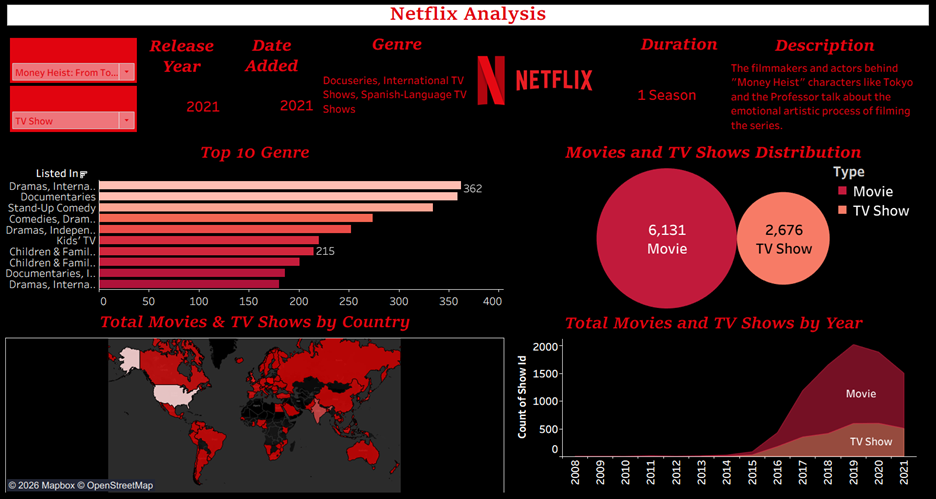

# Tableau-NetflixAnalysis
# Netflix Content Analysis Dashboard

This Tableau project explores the Netflix catalog to uncover trends in content formats, genre popularity, and global production. The dashboard and data story provide clear visual insights into how the streaming platform has grown and diversified its offerings over time.

## Objective

*   **Content Distribution**: Comparing the volume of Movies versus TV Shows on the platform.
*   **Growth Trends**: Tracking how much new content was added each year.
*   **Genre Popularity**: Identifying the most common genres and categories available to viewers.
*   **Geographic Reach**: Mapping out the top countries producing Netflix content.

## Dataset

**Source**: `netflix_titles.csv`

## Dashboard Overview

**Key Visuals & Insights**:
*   **Bubble Chart**: Shows the overall content split, revealing that Netflix is still primarily a movie platform with approximately 6,100 Movies compared to 2,700 TV Shows[cite: 19].
*   **Area Chart**: Displays the total movies and TV shows added by year, highlighting rapid expansion from 2015 to 2019[cite: 19].
*   **Bar Chart**: Ranks the top 10 genres, showing that Dramas, Documentaries, and Stand-Up Comedy are the most common[cite: 19].
*   **Map**: Visualizes content by country, pointing out that while the US leads, countries like India and Russia are major sources of content[cite: 19].
*   **Dynamic Title Details**: Interactive text fields that update to show the rating, duration, release year, and description for any selected movie or TV show[cite: 19].

## Technical Implementation

*   **Tableau Features**: Used the Storytelling feature with custom captions to guide viewers through the insights[cite: 19].
*   **Custom Formatting**: Applied a dark theme with a custom red color palette to match the Netflix brand identity[cite: 19].
*   **Interactive Filters**: Built dynamic dropdown filters for 'Type' and 'Title' that apply across multiple worksheets simultaneously[cite: 19].

## Project Files

*   **Tableau Workbook**: `NetfixAnalysis.twb`[cite: 20]
*   **Source Dataset**: `netflix_titles.csv`[cite: 19]
*   **Dashboard Screenshot**: `NetflixDashboard.png`
*   **Documentation**: `NetfixAnalysis.docx`[cite: 19]

## Contact

**Author**: Smiiti Badugu  
**GitHub**: [@smitibdg](https://github.com/smitibdg)

***
⭐ If you found this project useful, please consider giving it a star!
